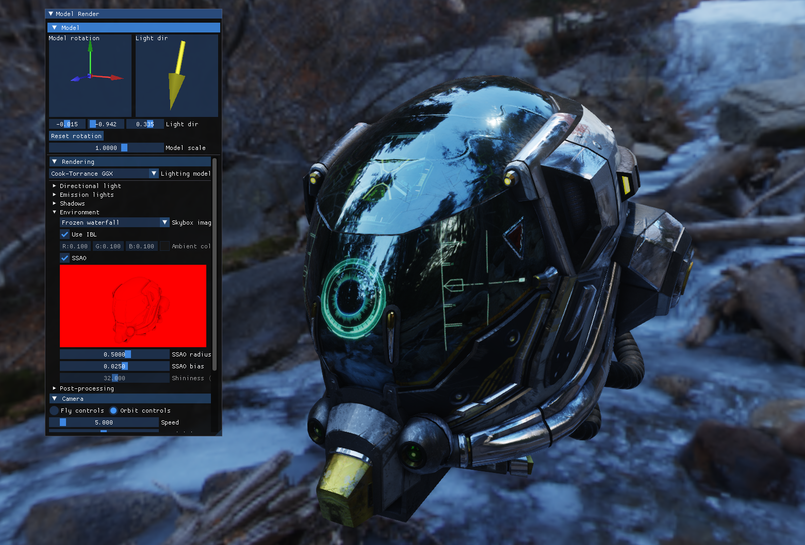

quarkGL
=======

A subatomic OpenGL graphics library and playground.

[](https://www.youtube.com/watch?v=rbC2D_ayePI&ab_channel=voithoz)

## Features

- Core
  - Shader loader & include system
  - Model loading via Assimp
  - Mesh and shader primitives
  - Framebuffer and texture system
  - Light, uniforms, and texture registry
  - Reusable GLSL shader library
- Rendering
  - Blinn-Phong lighting model
  - PBR lighting model (Cook-Torrance GGX)
  - Deferred shading
  - Runtime IBL, reflection probe prefiltering functions
  - Shadow mapping
  - Normal mapping
  - Compute shaders
  - SSAO
  - Instanced rendering
- Post-processing
  - HDR support
  - Bloom
  - Tone mapping
  - Gamma correction
  - FXAA
- Model viewer
  - Camera system with fly and orbit controls
  - ImGui renderer UI
- Debugging
  - Debug event integration
  - Render pass debug groups

See [examples](examples/) for sample screenshots.

## Building

quarkGL uses [Bazel](https://bazel.build/) as its build system. To begin, first
[install Bazel](https://docs.bazel.build/install.html).

To be able to actually compile the dependencies, run the following to install
the appropriate tools and headers (on Ubuntu/Debian):

```
$ sudo apt-get install build-essential xorg-dev libgl1-mesa-dev libglu1-mesa-dev
```

To get the linter, also run:

```
$ sudo apt-get install clang-tidy
```

You can build and run the main model renderer, which uses many of the features
of the library.

```
$ bazel run //model_render -- --model path/to/model.gltf
```

Or you can check out any of the other [examples](examples/).

## Developing

In addition to the build tooling, you may also want to build a [compilation
database](http://clang.llvm.org/docs/JSONCompilationDatabase.html) in order to
enable the linter and semantic completion in your editor. 

Use
[bazel-compilation-database](https://github.com/grailbio/bazel-compilation-database)
to extract the `compile_commands.json` file.

```
$ bazel-compdb -s
```

Once the `compile_commands.json` file exists, run the following to execute the
linter:

```
$ ./run_linter.sh
```

## About

This library was built as a way to learn modern OpenGL and graphics techniques.
Note that it is _not_ production capable, although parts may be useful as a
reference.

A big thank you goes to the wonderful tutorials by Joey de Vries at
[learnopengl.com](https://learnopengl.com), and to the wider graphics
community!

## Open Source

quarkGL uses several open source libraries itself. Thanks goes to the following
projects that were used:

- GLFW
- GLAD
- GLM
- stb_image
- assimp
- Dear ImGui
- imGuIZMO.quat
