Examples
========

This directory contains C++ and shader examples showcasing features of the
library.

You can run them via:

```
$ bazel run //examples:example_name
```

## Bloom

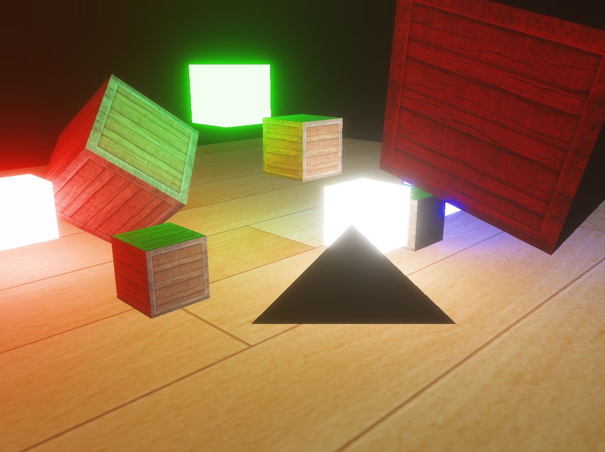

## Compute

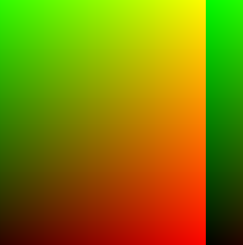

## Deferred

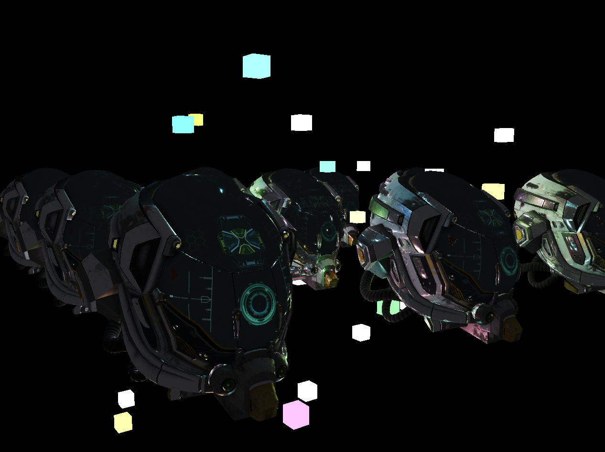

## Geometry shader

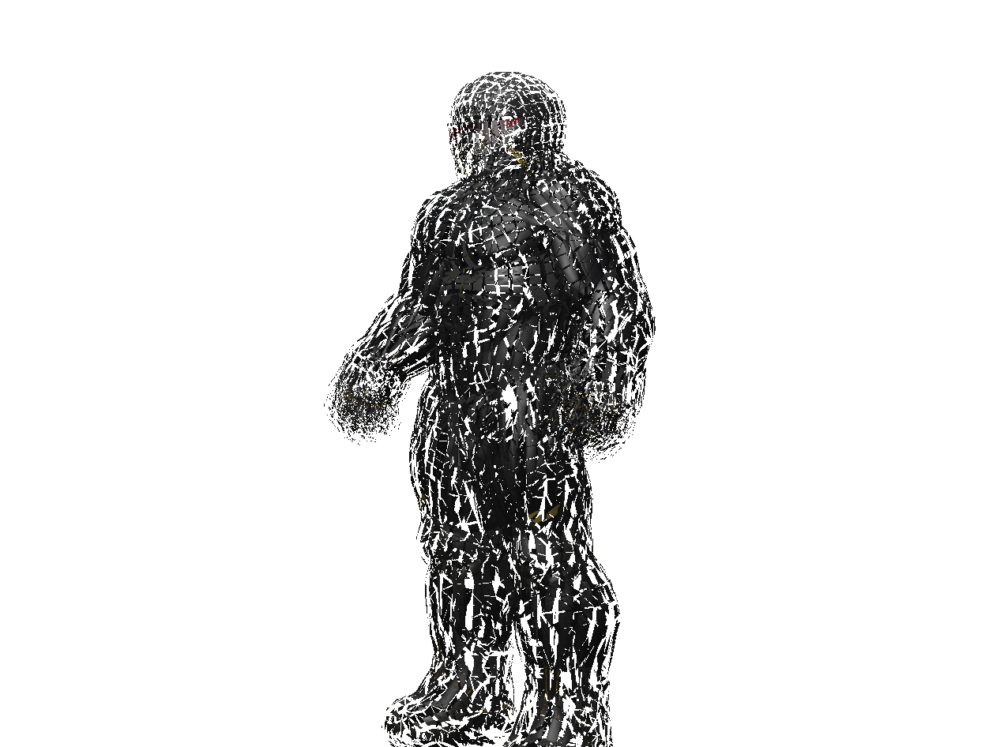

## HDR

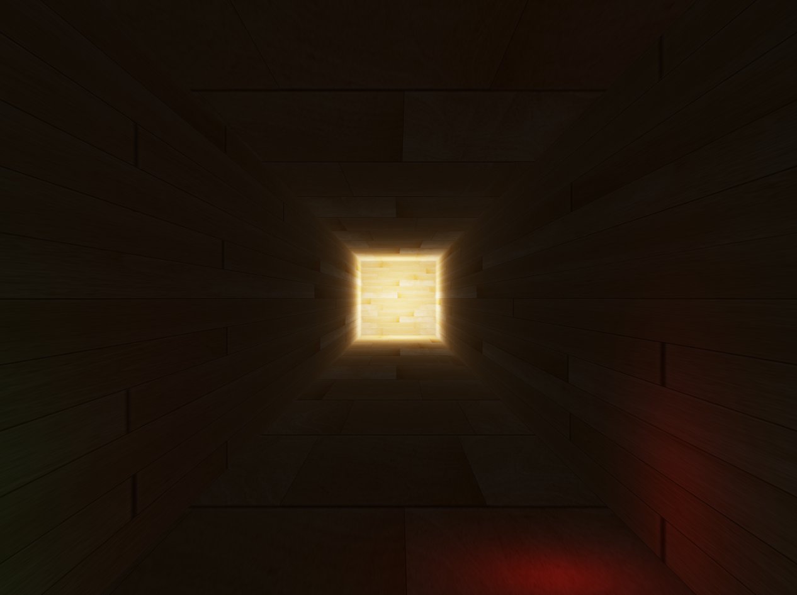

## Instancing

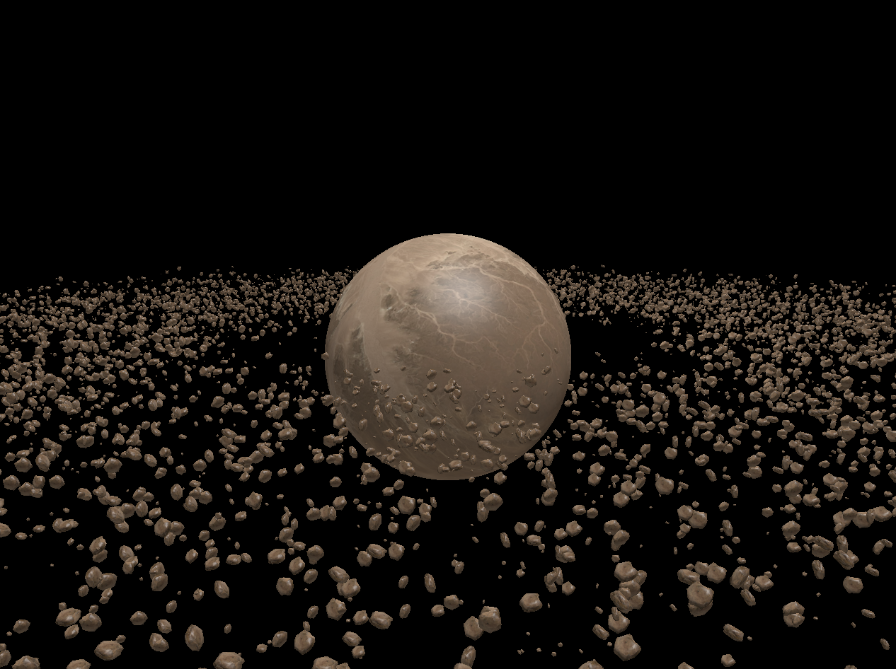

## Normal mapping

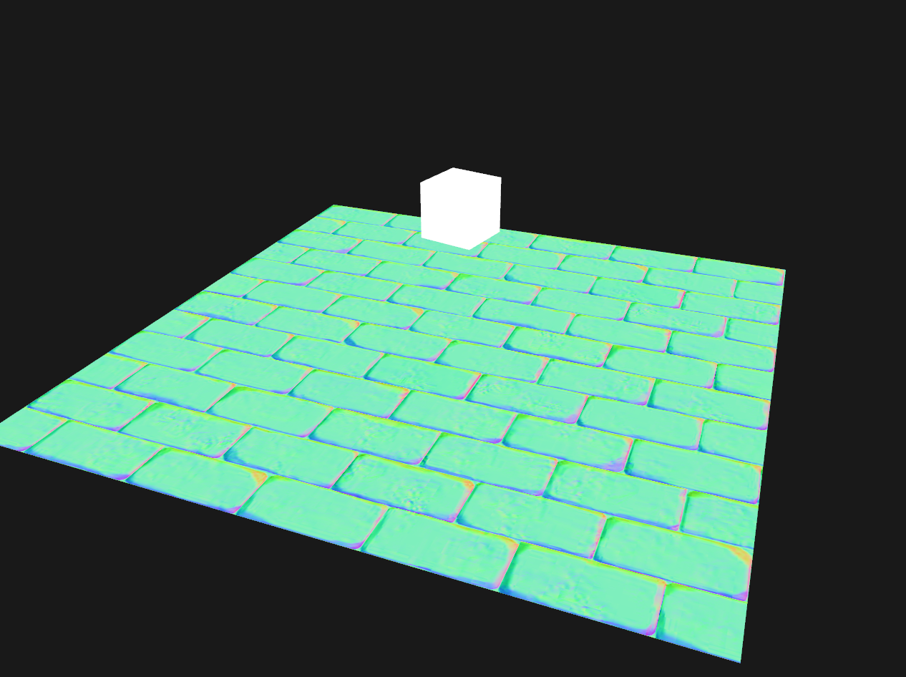

## PBR

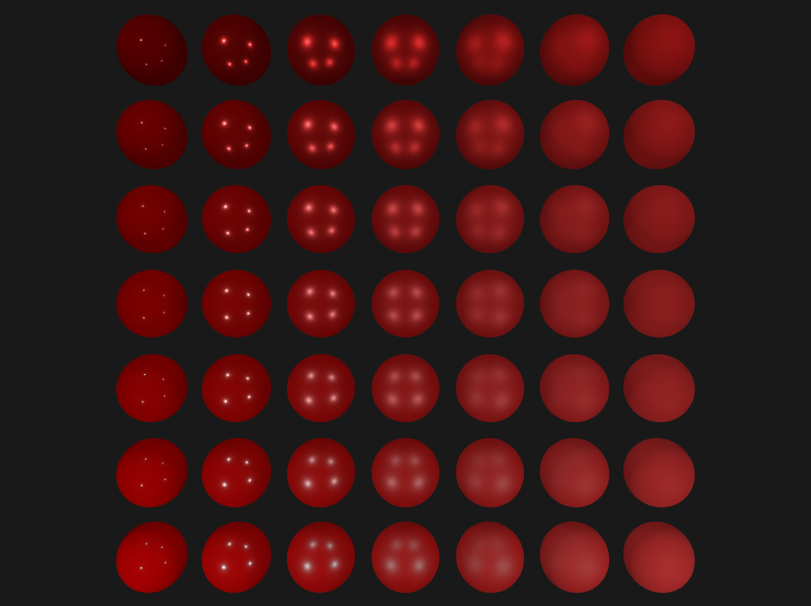

## Post processing

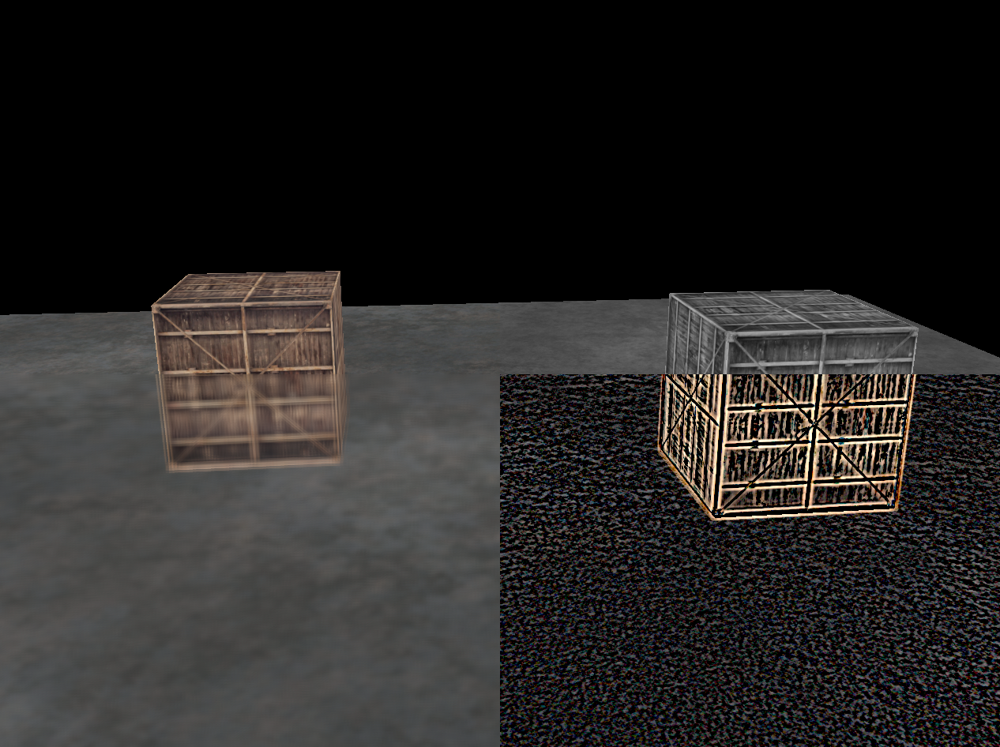

## Shadow mapping

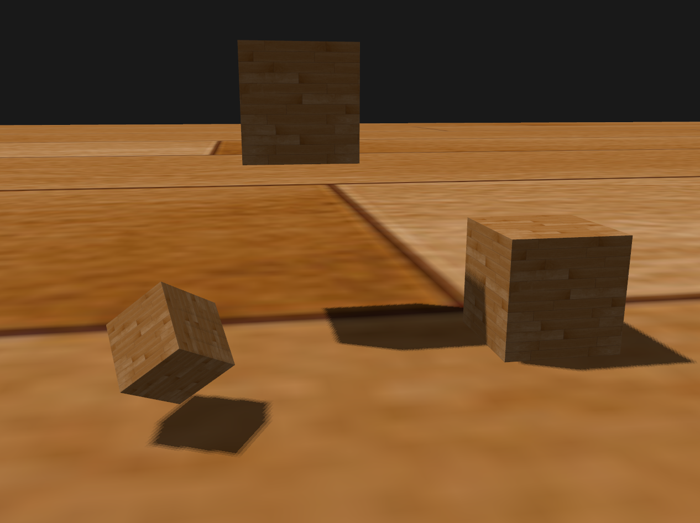

## SSAO

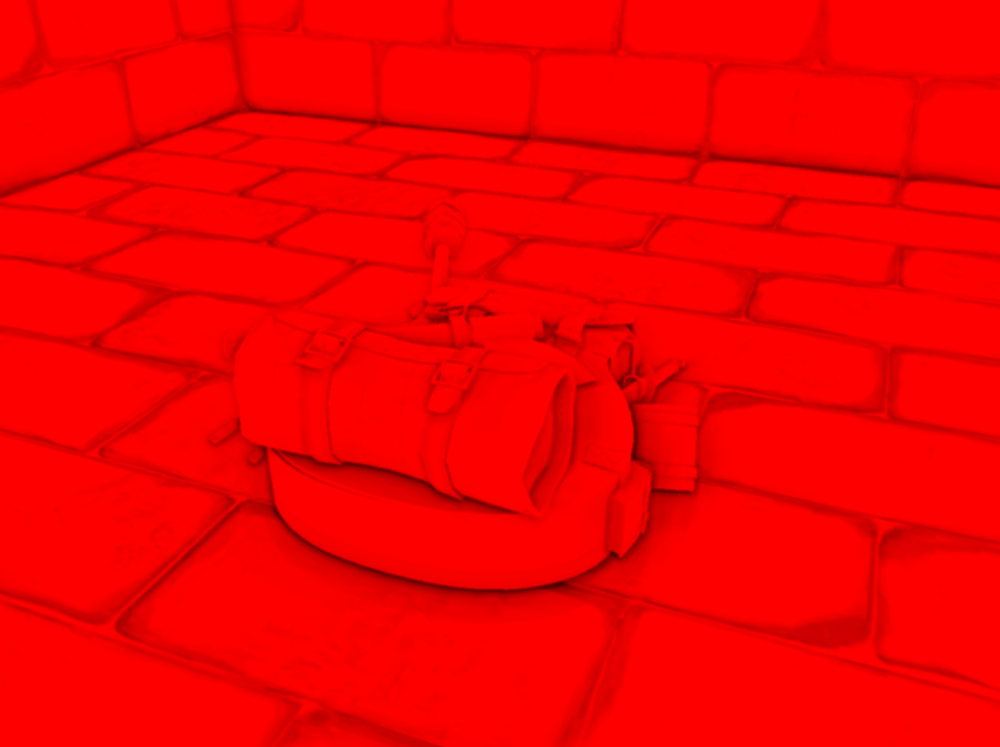
